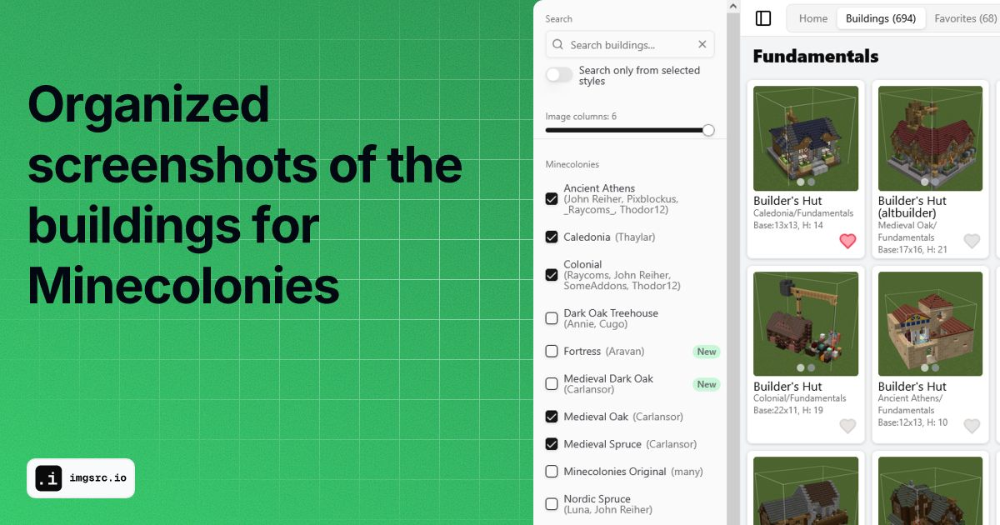

# Minecolonies Style Explorer

This is a small and unofficial web app to view organized screenshots of the buildings from the Minecolonies Minecraft
mod.



## Features

- View screenshots of various buildings from the Minecolonies mod
- Organized and categorized for easy exploration
- Search by building names etc
- Responsive design for accessibility on different devices

## Tech/Libraries etc

- [Vite](https://vite.dev/)
- [tailwindcss](https://tailwindcss.com/)
- [shadcn/ui](https://ui.shadcn.com/)
- [Jotai](https://jotai.org/)
- [Blurhash](https://blurha.sh/)
- [prismarine-nbt](https://github.com/PrismarineJS/prismarine-nbt)

## Getting Started

### Adding themes

1. For a new theme, you need to add a new folder in the `public/themes` directory. You need to have the style (
   blueprints) folder downloaded somewhere on your local machine. Then run `create_theme_folders.py` script with the
   path to the style folder as. This will copy the structure and create folder for every blueprint.
2. Read the `rename_screenshots.py` script and run it if necessary to rename the screenshots to be in the format
   `{level?}{front|back}.jpg`.
3. Run `resize_images.py` to make the screenshots be square
4. Run [optimize-images](https://pypi.org/project/optimize-images/) to scale the images down, convert to jpg and
   optimize them:
   ```bash
   optimize-images -ca -fd -q 90 -mw 700 -mh 700 .\public\minecolonies\colonial
    ```
5. Run `theme_json_builder.py` to create the main `themes.json`. Add the theme to the file's config object.

> Note: the scripts don't have cli arguments yet, so you need to change the paths in the scripts manually to match your
local setup.


### Prerequisites

- Node.js and pnpm installed on your local machine

### Installation

1. Clone the repository:
 ```bash
 git clone https://github.com/tomp2/minecolonies-style-explorer.git
 ```

2. Navigate to the project directory:

```bash
cd minecolonies-style-explorer
```

3. Install dependencies:

```bash
pnpm install
```

### Running the App

To start the development server, run:

```bash
pnpm run dev
```

This will start the app and you can access it at http://localhost:5173

### Continuous Deployment

The project uses GitHub Actions (workflow defined in.github/workflows/deploy.yml) to build and deploy the project
automatically to Github Pages when something is pushed to the main branch.

### Contributing

1. Fork the repository
2. Create a new branch (git checkout -b feature-branch)
3. Make your changes
4. Commit your changes (git commit -m 'Add some feature')
5. Push to the branch (git push origin feature-branch)
6. Open a pull request

### Acknowledgments❤️

- [Minecolonies](https://minecolonies.com/) - The Minecraft mod and the builders

